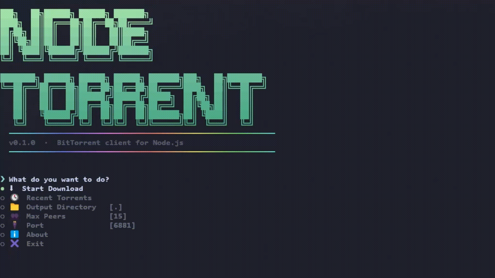

# NodeTorrent

[Read in Russian](README.ru.md) | English



A lightweight, minimal-dependency BitTorrent CLI client built from scratch with Node.js and TypeScript.

NodeTorrent is designed to demonstrate low-level peer-to-peer networking, binary protocol parsing over TCP and UDP, Bencode decoding, and async disk I/O operations.

This is an early-stage project (`v0.1.0`). The current focus is on getting the core download path right: parsing `.torrent` files, announcing to HTTP/HTTPS and UDP trackers, connecting to peers, exchanging wire protocol messages, and writing verified pieces to disk. Seeding, DHT, magnet links, PEX, and encryption are not implemented yet.

The goal is not to replace mature clients like qBittorrent or Transmission, but to be a readable reference for how BitTorrent works under the hood. Most of the protocol — trackers, peer connections, wire messages, piece verification — is implemented from scratch; only Bencode decoding relies on an existing library.

Planned directions for future versions include seeding, DHT, magnet links, PEX, and protocol encryption, a full architectural refactor of the project, and a standalone `.exe` build via Node.js SEA (Single Executable Applications) so the CLI can be run without installing Node.js. None of these are committed yet — this is a solo side project, and priorities may shift as the protocol core matures.

## Features

- **Multi-Tracker Support**: Parallel polling of HTTP, HTTPS, and UDP trackers with support for `announce-list`. A set of public fallback trackers is used when the torrent's own trackers fail.
- **Wire Protocol Implementation**: Custom TCP wire protocol engine handling Handshake, Bitfield, Have, Request, Piece, and Choke/Unchoke messages.
- **Performance Optimizations**:
  - **Pipelining**: Up to `MAX_PIPELINE` (10) queued block requests per peer to maximize throughput.
  - **Endgame Mode**: When ≤3 pieces remain, duplicate requests are sent to multiple peers to avoid stalling on slow ones.
- **Integrity & Storage**:
  - SHA-1 hash verification for all downloaded pieces.
  - Support for single-file and multi-file torrent layouts with precise offset writing.
- **Interactive CLI**: Menu-driven configuration and real-time terminal dashboard monitoring progress, peer counts, and transfer speeds.

## Tech Stack

- **Runtime**: Node.js (ES Module format)
- **Language**: TypeScript 7.0
- **Networking**: `node:net` (TCP), `node:dgram` (UDP), `node:http` / `node:https`
- **Storage**: `node:fs/promises`
- **Parsing**: [`bencode`](https://www.npmjs.com/package/bencode) for `.torrent` decoding
- **CLI**: [`consola`](https://www.npmjs.com/package/consola) for logging, [`gradient-string`](https://www.npmjs.com/package/gradient-string) for terminal styling
- **Dev Tooling**: `tsx` for running TypeScript directly, `typescript` for type checking

## Architecture

```text
src/
├── download/              Download orchestration
│   ├── downloader/        Peer pool, queue, FileManager, PieceAssembler
│   └── peer/              Wire protocol: handshake, messages, socket handling
├── torrent/               .torrent loader, Bencode parser, infoHash computation
├── tracker/               HTTP/HTTPS and UDP tracker clients, peer parsing
├── ui/                    CLI menu, live dashboard, progress rendering
├── events/                Global event bus for download/peer/UI events
└── main.ts                Application entry point
```

## Getting Started

### Prerequisites

- Node.js >= 20
- npm or pnpm

### Quick Start

```bash
git clone https://github.com/quarnel-dev/nodetorrent.git

cd nodetorrent

npm i

npm run dev
```

*Made with ❤️ by Quarnel*
